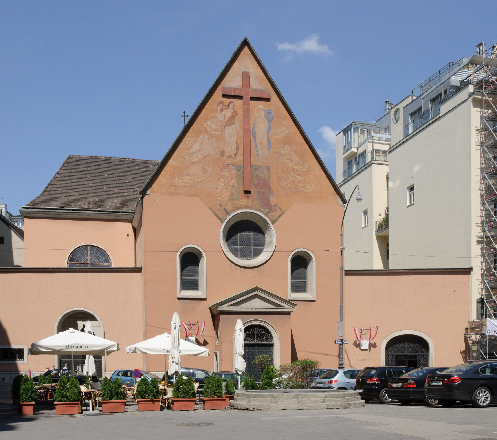

# THE LOW COUNTRIES AND GERMANY.
Passage to Ostend.—The Capuchin church.—Ghent.—Quiet and Content,
the presiding deities of Flanders.—Antwerp.—The Place de Meir.—Silence
and solitude of the town, contrasted with the tumult and uproar of London.
Ostend, 21st June, 1780.

WE had a rough passage, and arrived at this imperial haven in a
piteous condition. Notwithstanding its renown and importance, it is
but a scurvy place—preposterous Flemish roofs disgust your eyes
when cast upwards—swaggering Dutch skippers and mongrel
smugglers are the principal objects they meet with below; and then
the whole atmosphere is impregnated with the fumes of tobacco,
burnt peat, and garlick. I should esteem myself in luck, were the
nuisances of this seaport confined only to two senses; but, alas! the
apartment above my head proves a squalling brattery, and the
sounds which proceed from it are so loud and frequent, that a
person might think himself in limbo, without any extravagance.
In hope of some relief, I went to the Capuchin church, a large
solemn building, in search of silence and solitude; but here again
was I disappointed. There happened to be an exposition of the holy
wafer with ten thousand candles; and whilst half-a-dozen
squeaking fiddles fugued and flourished away in the galleries, and
as many paralytic monks gabbled before the altars, a whole posse
of devotees, in long white hoods and flannels, were sweltering on 
either side.
This papal piety, in warm weather, was no very fragrant
circumstance; so I sought the open air again as fast as I was able.
The serenity of the evening—for the black huddle of clouds, which
the late storms had accumulated, were all melted away—tempted
me to the ramparts. There, at least, thought I to myself, I may
range undisturbed, and talk with my old friends the breezes, and
address my discourse to the waves, and be as romantic and fanciful
as I please; but I had scarcely begun a poetic apostrophe, before
out flaunted a whole rank of officers, with ladies and abbés and
puppy dogs, singing, and flirting, and making such a hubbub, that I
had not one peaceful moment to observe the bright tints of the
western horizon, or enjoy those ideas of classic antiquity which a
calm sunset never fails to bring before my imagination.
Finding, therefore, no quiet abroad, I returned to my inn, and
should have gone immediately to bed, in hopes of relapsing into
the bosom of dreams and delusions; but the limbo I mentioned
before grew so very outrageous, that I was obliged to postpone my
rest till sugarplums and nursery eloquence had hushed it to repose.
At length peace was restored, and about eleven o’clock I fell into a
slumber. My dreams anticipated the classic scenes of Italy, the
proposed term of my excursion.
Next morning I arose refreshed with these agreeable impressions.
No ideas, but such as Nemi and Albano suggested, haunted me
whilst travelling to Ghent. I neither heard the coarse dialect which
was talking around me, nor noticed the formal avenues and marshy
country which we passed. When we stopped to change horses, I
closed my eyes upon the dull prospect, and was transported
immediately to those Grecian solitudes which Theocritus so
enchantingly describes.
To one so far gone in the poetic lore of ancient days, Ghent is not
the most likely place to recall his attention; and I know nothing
more about it, than that it is a large, ill-paved, plethoric, pompouslooking city, with a decent proportion of convents and chapels, 
monuments, brazen gates, and gilded marbles. In the great church
were several pictures by Rubens, so striking, so masterly, as to
hold me broad awake; though, I must own, there are moments
when I could contentedly fall asleep in a Flemish cathedral, for the
mere chance of beholding in vision the temple of Olympian
Jupiter.
But I think I hear, at this moment, some grave and respectable
personage chiding my enthusiasm—“Really, sir, you had better
stay at home, and dream in your great chair, than give yourself the
trouble of going post through Europe, in search of places where to
fall asleep. If Flanders and Holland are to be dreamed over at this
rate, you had better take ship at once, and doze all the way to
Italy.” Upon my word, I should not have much objection to that
scheme; and, if some enchanter would but transport me in an
instant to the summit of Ætna, anybody might slop through the
Low Countries that pleased.
Being, however, so far advanced, there is no retracting; and I am
resolved to journey along with Quiet and Content for my
companions. These two comfortable deities have, I believe, taken
Flanders under their especial protection; every step one advances
discovering some new proof of their influence. The neatness of the
houses, and the universal cleanliness of the villages, show plainly
that their inhabitants live in ease and good humour. All is still and
peaceful in these fertile lowlands: the eye meets nothing but round
unmeaning faces at every door, and harmless stupidity smiling at
every window. The beasts, as placid as their masters, graze on
without any disturbance; and I scarcely recollect to have heard one
grunting swine or snarling mastiff during my whole progress.
Before every village is a wealthy dunghill, not at all offensive,
because but seldom disturbed; and there sows and porkers bask in
the sun, and wallow at their ease, till the hour of death and bacon
arrives.
But it is high time to lead you towards Antwerp. More rich
pastures, more ample fields of grain, more flourishing willows! A 
boundless plain lies before this city, dotted with cows, and
speckled with flowers; a level whence its spires and quaint roofs
are seen to advantage! The pale colours of the sky, and a few
gleams of watery sunshine, gave a true Flemish cast to the scenery,
and everything appeared so consistent, that I had not a shadow of
pretence to think myself asleep.

